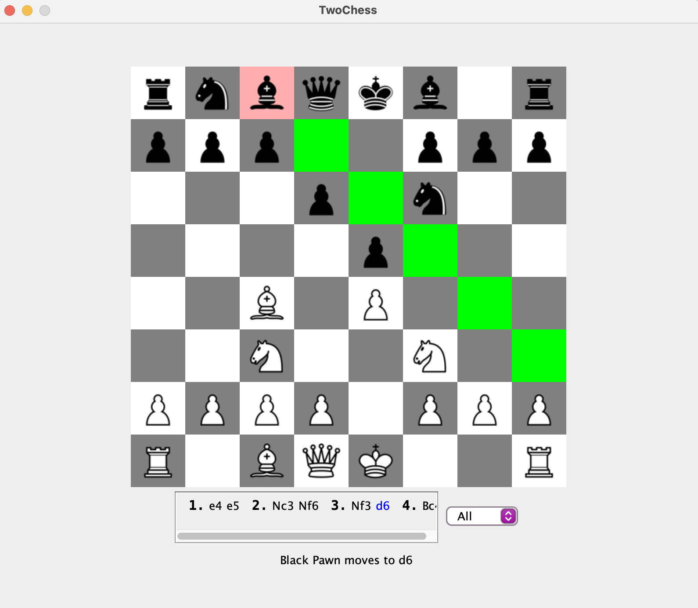

# TwoChess

*NOTE: This project was cloned from my private class repository after my course ended* 

*TwoChess* is a recreation of chess in Java, written almost entirely from scratch. This began as a personal project for a second-year Object-Oriented Design course at the University of British Columbia.

## How to Run
Run the file `src/main/ui/TwoChess.java`.

## Features
- Checkmate detection
- GUI move highlighting
- Local storage to save games (options pops up when you try to close the window)
- Move history panel where you can click on particular moves for more information

## Things I Learned
- Creating a Java GUI with Java Swing
- Testing: achieved 99%+ code coverage with JUnit 5
- Abstraction and inheritance by making individual piece classes extend the abstract `Piece.java` class
- Separating the model and UI parts of a program
- Breaking down a complex project into easier parts and making a plan to complete it within a tight personal schedule

## What Can Be Improved
- Implement all the features of chess, including el-passant, castling, pawn promotion, and three-move repetition
- Improve design of code by abstracting out the game logic from `Board.java` (currently, it is responsible for doing too many things)
- Improve efficiency of checkmate-detection algorithm, making sure it isn't called where it doesn't need to be called
